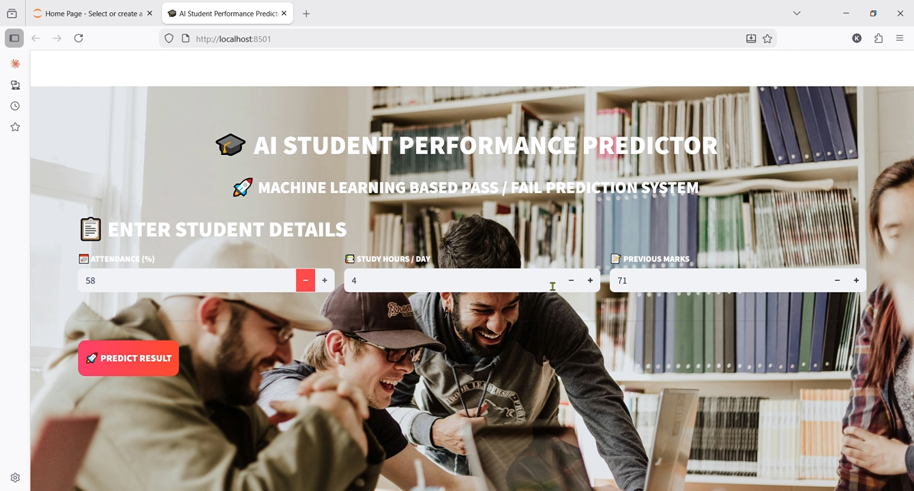

🎯 AI Student Performance Predictor

## 📌 Overview
This project predicts whether a student will PASS or FAIL using Machine Learning based on:
- Attendance
- Study Hours
- Previous Marks

## 🛠 Tech Stack
- Python
- Pandas, NumPy
- Scikit-learn
- Matplotlib, Seaborn

## 🤖 Models Used
- Logistic Regression
- Decision Tree Classifier

## 📊 Features
- Data preprocessing
- Model training
- Accuracy evaluation
- Confusion matrix visualization
- Real-time prediction

## 🚀 How to Run
1. Install dependencies:
2. Run:

## 📊 Dataset
This project uses manually created sample data within the code.

## 🔮 Future Improvements
- Use real dataset (CSV)
- Build web app (Streamlit)

## 📸 Output

## 🎥 Demo Video
[Watch Demo](C:\Users\KOUSHAL\Videos\Captures)
